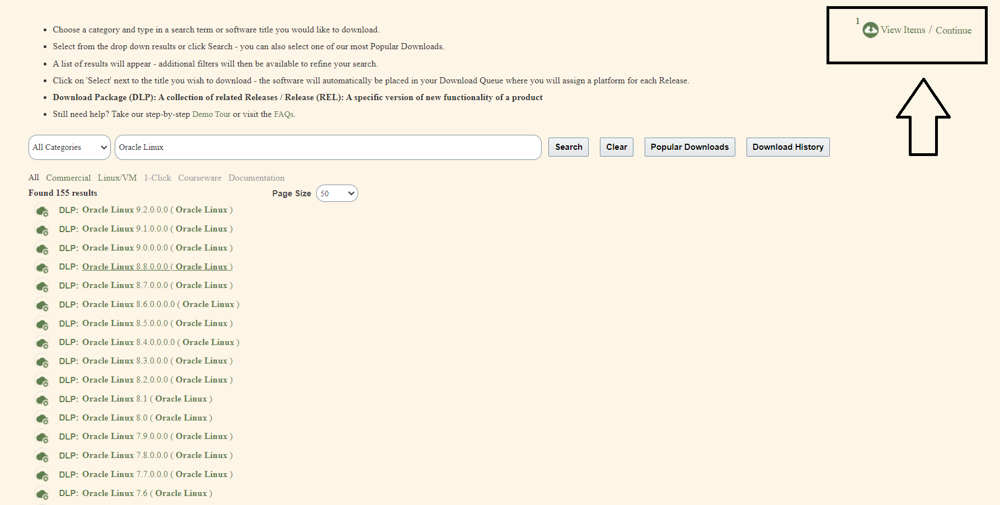
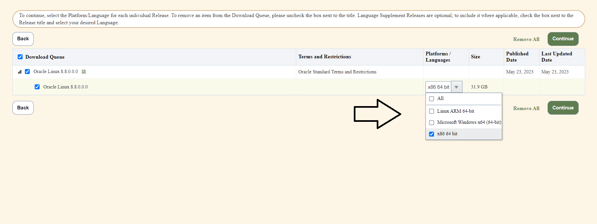
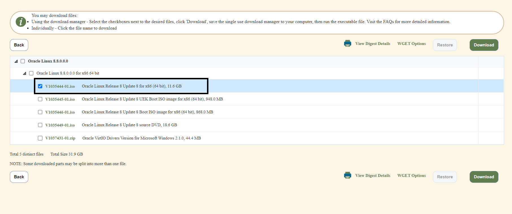
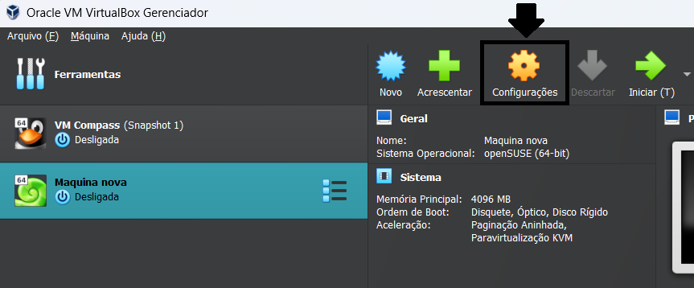
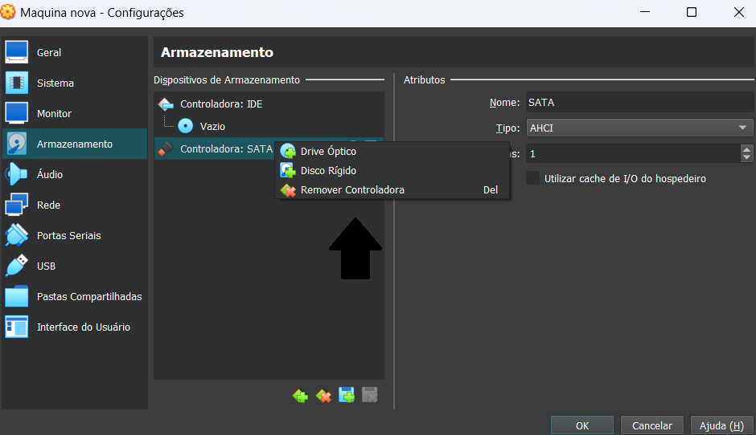
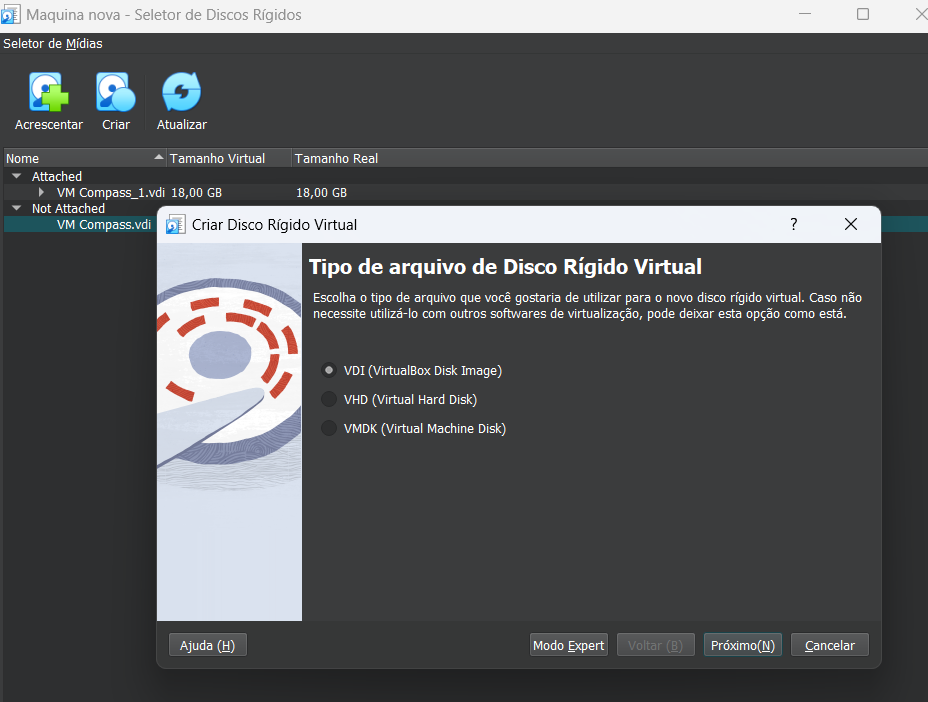
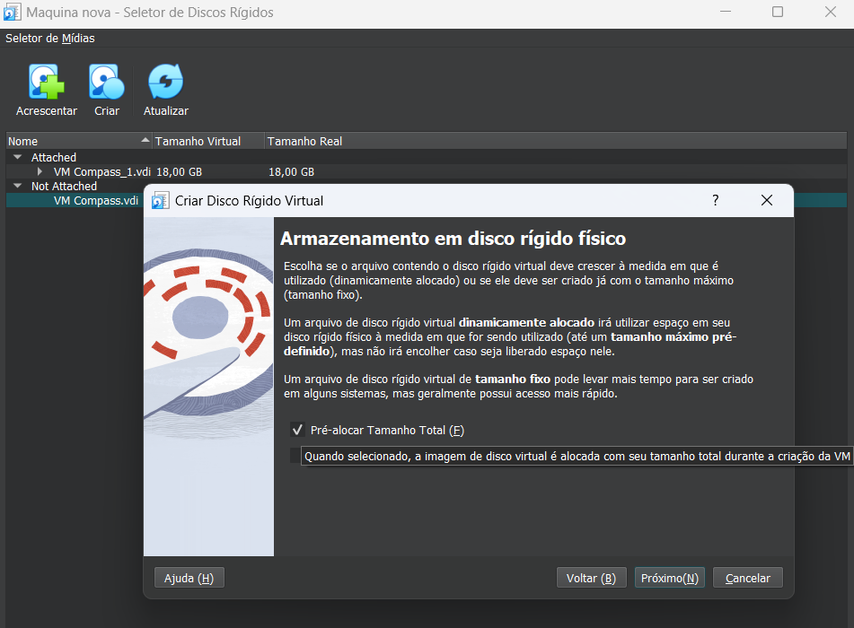
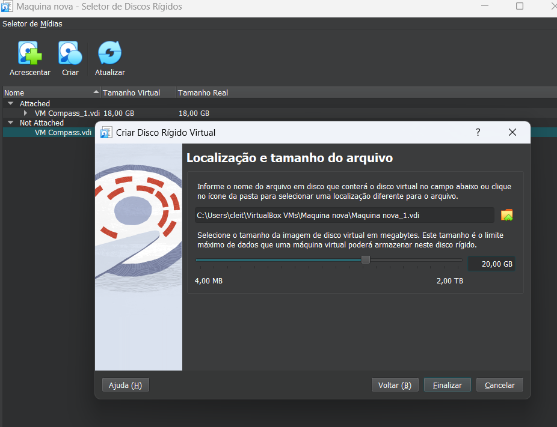
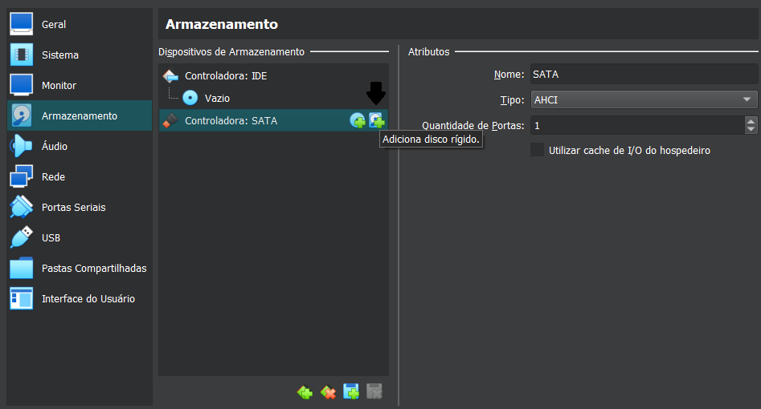
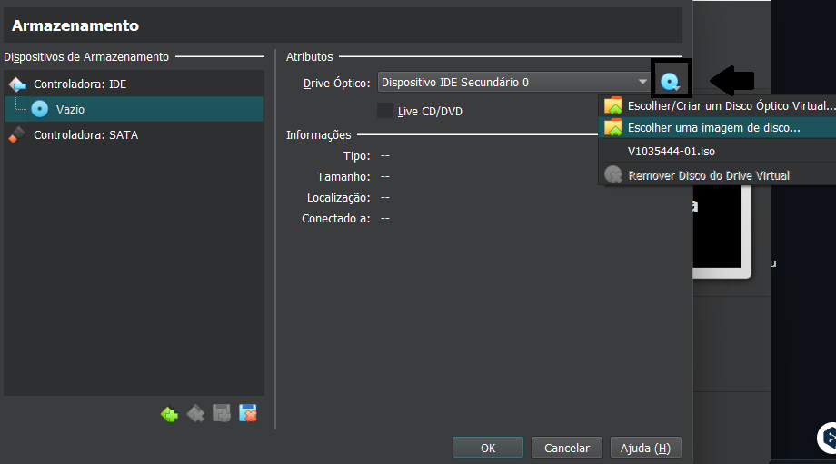

<h1 align="center">Instalando um servidor Oracle Linux 8.x em uma virtual box</h1>

<i>Neste repositório irei documentar passo a passo como deve ser feita a instalação do servidor Oracle Linux em uma VM.</i>

## Instalando o que é necessário
### Virtual Box
- Caso você não tenha instalado na sua máquina será necessário baixar e instalar uma Virtual Box.
- Recomendo que instale a própria Virtual Box da Oracle.
- Link para download: https://www.oracle.com/br/virtualization/technologies/vm/downloads/virtualbox-downloads.html

### Oracle Linux
- Também será necessário uma versão do Oracle Linux para instalar na máquina virtual.
- Logo abaixo está o link do site para download, para acessá-lo será preciso criar uma conta da Oracle.
  - https://edelivery.oracle.com/osdc/faces/SoftwareDelivery
- Em seguida, selecione a versão do Linux que você quer utilizar e clique em "continue" como na imagem abaixo.

- Na próxima página selecione a plataforma/sistema operacional, para nosso caso de uso, x86 64bit servirá.

- Logo depois selecione o arquivo para download.
 

## Criando a máquina virtual (VM)
- Abra o Oracle VM VirtualBox Gerenciador
1. Clique em "Novo" ou "New", dê um nome a sua máquina, confira se o tipo é "Linux" e mantenha as configurações iniciais.
2. Na parte de "Hardware", selecione para a Memória Base "4096 MB" (4GB de RAM) e selecione apenas uma CPU.
3. Na parte "Disco Rígido Virtual / Virtual Hard Disk", não será preciso adicionar uma agora no momento, escolha "Não acrescentar um Disco Rígido Virtual" (a última opção).
4. Finalize a criação da VM.

### Adicionando armazenamento na VM
- No Oracle VM VirtualBox Gerenciador, clique na sua máquina uma vez e depois selecione "Configurações".

- Em seguida vá em "Armazenamento" e clique com o botão direito do mouse em "controladora: SATA", selecione a opção "Disco Rígido"

- Agora clique em "Criar" e selecione o tipo de arquivo como "VDI (VirtualBox Disk Image)"

- Recomendo que você selecione está opção "Pré-alocar Tamanho Total", principalmente se você não tem muito espaço de armazenamento disponível.

- Definindo um tamanho para o disco rígido virtual, recomendo que selecione um tamanho maior que o arquivo de instalação do "Oracle Linux". Nesse caso vou selecionar 20 GB que é mais do que suficiente.

- Agora basta finalizar o processo e adicionar o disco rígido virtual que você criou.

### Instalando o Linux na VM
- De volta as configurações de sua máquina, selecione novamente "Armazenamento"
- Clique com botão esquerdo no "Disco vazio" na "Controladora: IDE"
- Depois clique no disco azul mais a direita da tela (indicado na imagem)
- Escolha "imagem de disco", selecione o arquivo ISO do Linux que baixamos anteriormente, no meu caso é o arquivo "V1035444-01.iso".

- Clique em "OK", agora basta iniciar a máquina e começar a instalação do Linux.

## Instalação e configuração do Linux na VM
- Agora já com a máquina virtual ligada (VM), se ocorrer tudo certo aparecerá está tela:

- Selecione "Install Oracle Linux 8.x.x" para instalar a versão que foi baixada do Oracle Linux.

- Escolha o idioma que você quer utilizar durante a instalação

- Selecione o Disco Rígido Virtual que foi criado em "Installation Destination" ou "Destino de instalação"

- ATA VBOX HARDDISK (disco virtual criado) já está selecionado, basta clicar em "DONE" e voltar.

- Vamos agora para "Software Selection" ou "Seleção de Software", deixe marcadas estas duas opções da imagem.

- Criando um usuário Root, em "Root Password"

- Configurando "Network and Host Name window", no caso as configurações de rede, na imagem a conexão é a cabo e já está selecionada, faça o mesmo com sua conexão.

- Configurando "Time Zone", selecione a sua região.

- Na seção de "sistema" ou "system", habilite o "Kdump"

- Selecione a opção de "Installation Source", e escolha "Auto-detected" como opção de instalação. Depois disso, clique no botão de verificar.
 

  
- Depois de configurar tudo, comece a instalação.

- Quando termianr a instalação clique em "Reboot" para reiniciar o sistema.

- Aceite a licença para terminar a configuração

- Termine a configuração

### Agora basta fazer o login com seu usuário, selecionar o idioma do sistema e teclado, e seu sistema estará pronto!

